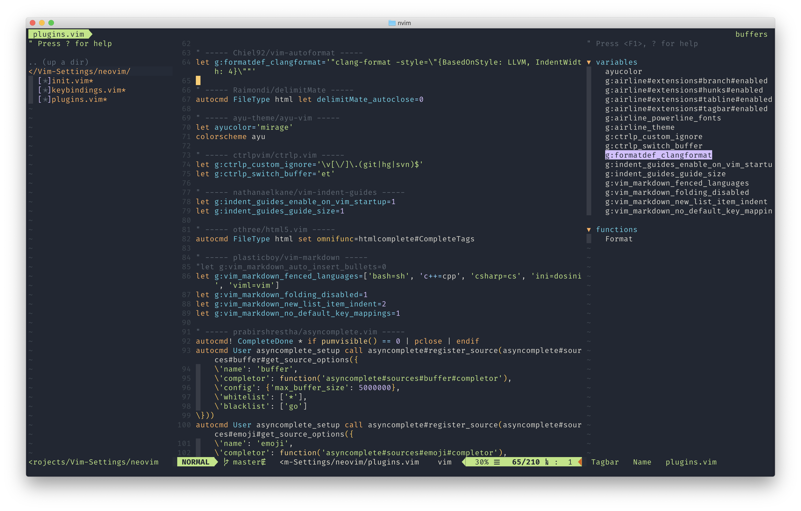

# Vim-Settings

> My settings of _Vim_ &amp; _Neovim_ for `C` / `C++` / `Java` / `Python` / `Go` / `HTML` / `CSS` / `JS` development.

## Prerequisites

- Editor
  - [Vim](https://www.vim.org) 8.0 or newer
  - [Neovim](https://neovim.io) 0.3 or newer
- Language
  - C / C++
  - Java
  - Python
  - Go
  - TypeScript
- Language Server
  - [Clangd](https://clang.llvm.org/extra/clangd)
  - [Gopls](https://github.com/golang/go/wiki/gopls)
  - [Bash Language Server](https://github.com/mads-hartmann/bash-language-server)
- Tools
  - [Git](https://git-scm.com)
  - [Clang](https://clang.llvm.org)
  - [CMake](https://cmake.org)
  - [Pynvim](https://github.com/neovim/pynvim)
  - [jedi](https://pypi.org/project/jedi)
  - [flake8](https://pypi.org/project/flake8)
  - [pydocstyle](https://pypi.org/project/pydocstyle)
  - [mypy](https://pypi.org/project/mypy)
  - [autopep8](https://pypi.org/project/autopep8)
  - [isort](https://pypi.org/project/isort)
  - [Node.js](https://nodejs.org)
  - [Prettier](https://prettier.io)
  - [shfmt](https://github.com/mvdan/sh)

## Screenshot
- 

## How to use

- Clone remote repository to local directory.

```
$ git clone https://github.com/hwyncho/Vim-Settings.git
```

- Execute shell script.

```
$ cd Vim-Settings/
$ bash setup.sh --nvim --vim
$ bash setup.sh --help
```
